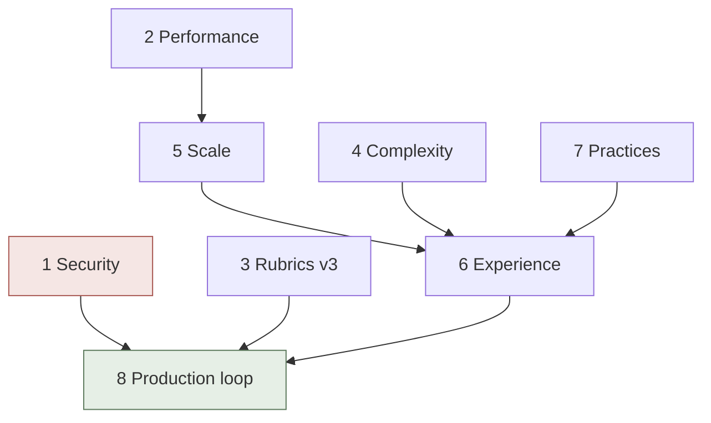
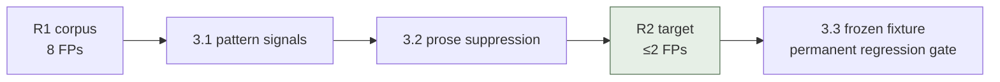
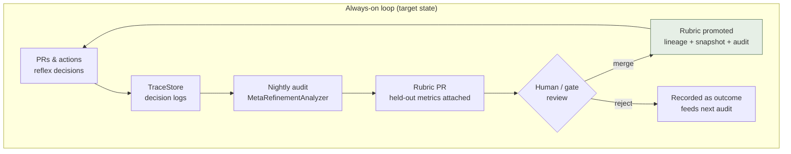

# Harness Framework — Optimisation Planning

> A structured, numbered improvement plan for the Harness Framework (v0.4.2).
> Every phase, stage, and task carries an index number for direct reference
> (e.g., "start **2.1**", "what's the status of **3.2**?").
> Source material: `TechBragging.md` Part 2, `ROADMAP.md` Waves D–E,
> `docs/reflex_baseline_r1.md` v3 backlog, `PROJECT_CONTEXT.md` known limits.

**Status legend**: ☐ pending · ◐ in progress · ☑ complete
**Priority**: P0 = trust-critical · P1 = high value · P2 = polish

---

## 0. Menu

| # | Phase | Tasks | Priority | Theme |
|---|---|---|---|---|
| **1** | [Security Hardening](#1-security-hardening) | 3 | **P0** | close the real attack surface |
| **2** | [Performance & Efficiency](#2-performance--efficiency) | 3 | P1 | absorb reflex-tier write amplification |
| **3** | [Reflex Quality — v3 Rubrics](#3-reflex-quality--v3-rubrics) | 3 | P1 | kill the prose-token FPs |
| **4** | [Complexity Reduction](#4-complexity-reduction) | 3 | P2 | narrower, cleaner public surface |
| **5** | [Scale & Integration (Wave D)](#5-scale--integration-wave-d) | 4 | P1 | MCP, real backends, export |
| **6** | [Experience (Wave E)](#6-experience-wave-e) | 3 | P1 | live visibility |
| **7** | [Quality & Best Practices](#7-quality--best-practices) | 4 | P2 | docs, types, hooks, flakes |
| **8** | [Production Incarnation](#8-production-incarnation) | 3 | **P0** | the always-on loop |

---

## 1. Security Hardening

*Goal: eliminate the identified real attack surface before wider exposure.*

### 1.1 RunCommandTool shell migration — ☐ P0
- ☐ Replace `shell=True` with `shlex.split()` + `shell=False` as the default executor
- ☐ Add explicit `allow_shell: bool = False` constructor opt-in for piped commands
- ☐ Regression-test the sandbox suite (`tests/test_tools.py`) plus new metacharacter-injection cases (`;`, `$(...)`, backticks, glob)
- **Acceptance**: no shell interpretation unless opted in; all 1,120+ tests green

### 1.2 Audit log signing — ☐ P0
- ☐ Add per-entry HMAC signature (`hmac.new(key, entry_hash).hexdigest()`) with env-injected key
- ☐ `verify_chain(check_signatures=True)` — detects re-chaining forgeries, not just edits
- ☐ Key-rotation tolerance: carry `key_id` in entry metadata
- **Acceptance**: tamper matrix extended — forged re-chained logs fail verification

### 1.3 CI workflow activation — ☐ P0
- ☐ Move `.github/workflows-pending/{ci,reflex_ci}.yml` → `.github/workflows/` from a workflow-scoped client
- ☐ Verify first advisory run on a real PR; confirm Step Summary renders
- ☐ Delete the staging README; update `PROOF.md` limits section
- **Acceptance**: reflex CI badge green on `main`; advisory comments appear automatically

---

## 2. Performance & Efficiency

*Goal: the reflex tier's 10× write amplification becomes routine load.*

### 2.1 Async DataGateway — ☐ P1 (ROADMAP T2.6)
- ☐ `aiohttp`-backed `DataGateway.request()` with connection pooling, retry + exponential backoff, circuit breaker
- ☐ Preserve mock fallback for the deterministic test suite
- **Acceptance**: 100 concurrent source requests, no blocking; existing gateway tests unchanged

### 2.2 Batch trace writer — ☐ P1
- ☐ `TraceStore.record_batch(records)` — single transaction for N records
- ☐ Reflex tier buffers decisions (flush at 50 records or 500ms)
- ☐ Benchmark vs per-statement autocommit (target ≥3× the 5,377 rec/s baseline)
- **Acceptance**: stress suite re-run with new numbers recorded in `TechBragging.md`

### 2.3 Parallel rule evaluation — ☐ P1
- ☐ `QualitativeLinter.run_full_audit()` evaluates the 6 rules concurrently (ThreadPoolExecutor; rules are pure functions)
- ☐ Latency assertion: full audit ≤ slowest single rule + 20%
- **Acceptance**: 6-rule audit p95 < 150ms under mock backend

---

## 3. Reflex Quality — v3 Rubrics

*Goal: eliminate the prose-token false positives documented in R1 (8 remaining N+1 FPs).*

### 3.1 Pattern signals — ☐ P1
- ☐ Extend `Rubric.required_signals` to accept **patterns** (`objects.get(`, `objects.filter(`, `session.query(`) not just bare tokens
- ☐ Mock backend honors pattern matching before scoring applies
- **Acceptance**: N+1 rule fires on ORM manager calls only; `dict.get()` loops score 0

### 3.2 Prose suppression — ☐ P1
- ☐ Token-source tagging in mock backend: distinguish code tokens from docstring/comment tokens
- ☐ Required-signal matching ignores prose regions
- **Acceptance**: `config.py` ("Surface objects" docstring) produces no N+1 flag; R2 rescan ≤ 2 findings

### 3.3 Corpus fixtures in CI — ☐ P1
- ☐ Freeze the 40-file R1 scan as `tests/fixtures/reflex_corpus_r1.json`
- ☐ Every rubric patch auto-evaluates against the frozen corpus in CI (regression metric: FP count per 40 files)
- **Acceptance**: rubric PRs show corpus delta in the Step Summary; FP regressions block

---

## 4. Complexity Reduction

*Goal: narrower public surface, single sources of truth.*

### 4.1 Export surface deprecation — ☐ P2
- ☐ Audit 131 exports; mark legacy symbols (`InstrumentedTool`, legacy CLI flags) via module `__getattr__` `DeprecationWarning`
- ☐ Target: ≤110 exports in v0.5.0 with a documented migration note
- **Acceptance**: deprecation warnings fire on legacy paths; suite green with `-W error::DeprecationWarning` on new paths

### 4.2 Mock heuristic consolidation — ☐ P2
- ☐ Single `reflex/heuristics.py` owning all keyword sets (bool suspicious words, rubric signals, remediation patterns)
- ☐ `MockReflexBackend`, linter constants, `ci.default_remediate` all import from it
- **Acceptance**: one file explains all mock behavior; no behavioral change to tests

### 4.3 CLI flag unification — ☐ P2
- ☐ Deprecate `--harness-*` legacy flags behind warnings; keep subcommands canonical
- **Acceptance**: `cli.py` parser shrinks; legacy paths warn but work for one minor version

---

## 5. Scale & Integration (Wave D)

*Goal: connect the framework to real ecosystems.*

### 5.1 Tool Gateway / MCP unification — ☐ P1 (ROADMAP T2.1)
- ☐ Unified registry for local tools + MCP servers (schema-validated at registration)
- ☐ Cheapest-provider routing (local vs MCP vs mock)
- **Acceptance**: one `registry.register()` for all tool kinds; routing decision traced

### 5.2 AgentBackend in Runner — ☐ P1 (ROADMAP T2.2)
- ☐ Wire `AgentBackend.complete()` into `SingleRunner` for agent-specifying scenarios
- ☐ Response caching to eliminate redundant API calls in circuits
- **Acceptance**: scenarios run against Mock/OpenAI/Anthropic backends interchangeably

### 5.3 Export pipeline — ☐ P1 (ROADMAP T2.7)
- ☐ `TraceStore.export_parquet()` (pyarrow) + `export_otel()`; reflex decision logs as first-class corpus
- **Acceptance**: `.parquet` + OTel JSON round-trip on a 10k-record store

### 5.4 Swarm choice routing — ☐ P1 (ROADMAP T1.7)
- ☐ `choice` primitive routes swarm tasks to worker roles by capability description
- **Acceptance**: routing accuracy ≥ rule-based decomposition on benchmark tasks; dissent preserved

---

## 6. Experience (Wave E)

*Goal: replace the static proof snapshot with living visibility.*

### 6.1 Health endpoint — ☐ P1 (ROADMAP T2.9)
- ☐ `harness health` + `HealthChecker` probing TraceStore, lineage, registry, reflex backend, escalation rate
- **Acceptance**: exit 0 healthy / 1 degraded / 2 critical; JSON output

### 6.2 Live dashboard — ☐ P1 (ROADMAP T2.10)
- ☐ FastAPI + server-rendered views over TraceStore: findings, escalation queue, rubric drift, autonomy phase
- ☐ Ship the static proof dashboard's design language as the base theme
- **Acceptance**: `python -m harness.dashboard` serves live data; refreshes from store

### 6.3 MCP adapter — ☐ P2 (ROADMAP T2.11)
- ☐ Expose the 19 surfaces as MCP tools/resources; `harness mcp` server command
- **Acceptance**: Claude Desktop / Cursor discovers surfaces; reflex scan callable as an MCP tool

---

## 7. Quality & Best Practices

### 7.1 Sphinx docs completeness — ☐ P2
- ☐ Create missing toctree pages (`surfaces.md`, `knowledge_graph.md`, `swarm.md`, `lifecycle.md`, `contributing.md`)
- **Acceptance**: `cd docs && make html` builds warning-free

### 7.2 mypy strict pass — ☐ P2
- ☐ Resolve `# type: ignore` escapes in fallback graph + CLI; enable stricter flags for `reflex/` and `store/`
- **Acceptance**: `mypy src/harness` clean under documented config

### 7.3 Pre-commit config — ☐ P2
- ☐ Ship `.pre-commit-config.yaml` (black, ruff, mypy, trailing whitespace)
- **Acceptance**: `pre-commit run --all-files` green

### 7.4 Flaky test hardening — ☐ P2
- ☐ Rewrite `test_concurrent_readers_and_writers` with deterministic scheduling (barrier + bounded readers)
- **Acceptance**: 20 consecutive suite runs, zero pool-stress flakes

---

## 8. Production Incarnation

*Goal: close the loop for real — the always-on self-improving deployment.*

### 8.1 Production reflex backend — ☐ P0
- ☐ Choose + implement production `ReflexBackend` (Jev API or local classifier head) behind the existing ABC
- ☐ Shadow-mode bake-off vs mock backend on the frozen corpus
- **Acceptance**: production backend meets ≤300ms p95 and ≥ mock precision on corpus; R2 autonomy promotion recorded in lineage

### 8.2 Nightly meta-refinement loop — ☐ P0
- ☐ Scheduled workflow: collect day's decision logs → `MetaRefinementAnalyzer` → rubric PRs opened automatically (advisory)
- ☐ Human merges = promotion event; auto-demotion on drift alarms
- **Acceptance**: first machine-opened rubric PR with held-out metrics in the body; audit chain records the full cycle

### 8.3 Rubric packs — ☐ P1
- ☐ Publish versioned community rubric packs (security, performance, style) with lineage + snapshots
- **Acceptance**: `RubricRegistry` loads a pack from a content hash; third-party pack installable

---

## 9. Execution Order (recommended)

| Step | Do | Why first |
|---|---|---|
| **9.1** | 1.3 → 8.1 → 8.2 | activates the repo's own gates + the always-on loop (the point of everything) |
| **9.2** | 1.1 → 1.2 | P0 security before wider exposure |
| **9.3** | 3.1 → 3.2 → 3.3 | rubric quality is the visible credibility metric |
| **9.4** | 2.1 → 2.2 → 2.3 | performance ahead of Wave D load |
| **9.5** | 5.x → 6.x | scale + experience tracks per ROADMAP |
| **9.6** | 4.x, 7.x | continuous polish alongside |

*Each task, when started, gets a branch named `opt/<number>-<slug>` (e.g., `opt/3.1-pattern-signals`) and closes with its acceptance criterion verified and this file's checkbox updated.*
