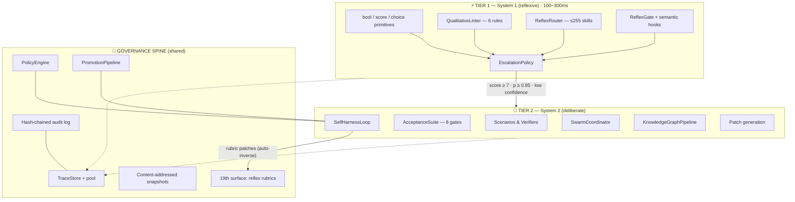
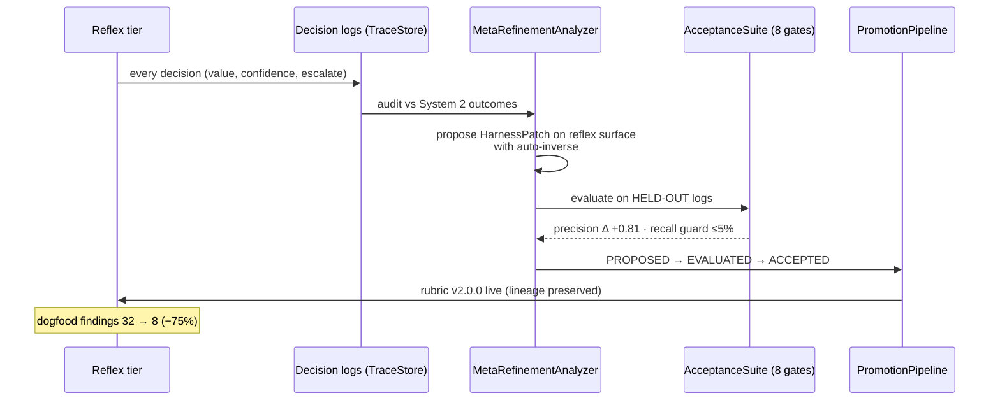
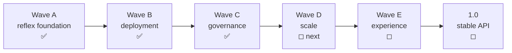

# Harness Framework

[](https://github.com/auge2u/harness-framework/blob/main/CHANGELOG.md)
[](https://github.com/auge2u/harness-framework)
[](https://www.python.org/)
[](LICENSE)
[](https://github.com/auge2u/harness-framework/blob/main/README.md#22-architecture-overview)
[](https://github.com/auge2u/harness-framework/blob/main/PROOF.md)

> **CI/CD for AI agents** — a self-validating, self-improving control plane that tests agent behavior, gates every change, routes work at millisecond reflex speed, and improves itself under verifiable governance.

---

## 1. Product Brief & Marketing Summary

### 1.1 The Problem

AI agents are going into production with **no control plane**. Code has CI/CD — every change is tested, gated, and reversible. Agent behavior has nothing:

- **Behavior is untested** — prompts, tools, and routing change by edit-and-pray; there is no "did this break the agent?" check.
- **Verification is unaffordable at scale** — LLM-judged review of every action costs seconds and cents per decision; nobody can check everything, every time.
- **Agents can't remember together** — each agent's knowledge dies with its context window; multi-agent systems pass ever-growing summaries until they drown in tokens.
- **Self-improvement is ungoverned** — an agent that rewrites its own instructions with no gates, no inverse, and no audit trail is a liability, not a feature.

### 1.2 The Value Proposition

The Harness Framework is the missing control plane. It treats every component of an agent system — prompts, tools, memory, sandbox, routing, evaluators, even its own quality rubrics — as **declared, versioned, patchable artifacts**, then wraps them in a two-tier decision architecture:

- **System 1 reflexes** (`bool` / `score` / `choice` primitives) answer in **100–300ms for ~$0.00004** — cheap enough to check *everything*.
- **System 2 reasoning** (scenarios, verifiers, patch generation) engages only where reflexes escalate — expensive thinking reserved for what deserves it.
- **A governance spine** (invertible patches, 8 acceptance gates, promotion pipeline, hash-chained audit log) makes every change — including the system's improvements to itself — **testable, reversible, and provable**.

### 1.3 Key Features

| Feature | What it does | Why it matters |
|---|---|---|
| ⚡ **Two-tier reflex architecture** | Millisecond probabilistic pre-screening (`bool`/`score`/`choice`) with confidence-based escalation to System 2 | 10x context reduction; verification you can afford on every PR |
| 🔄 **Governed self-improvement** | Every edit is a `HarnessPatch` with an auto-computed inverse, evaluated through 8 acceptance gates and a promotion pipeline | Agents that improve themselves *without* going out of control |
| 🕸️ **Knowledge-graph memory** | 4-stage pipeline (extract → resolve → assemble → query) gives agents shared, persistent, provenance-tracked memory | ~99% token reduction on multi-hop reasoning; memory survives context flushes |
| 🐝 **Swarm orchestration** | Work-stealing parallel agents with consensus aggregation and dissent detection | 3–5x speedup *and* explicit disagreement signals instead of averaged-away uncertainty |
| 📈 **Meta-refinement loop** | Quality rubrics are versioned artifacts; the system audits its own reflex decisions and ships rubric patches through the same governed pipeline | Measured, not vibes: one rubric patch cut dogfood findings **75%** ([evidence](docs/reflex_baseline_r1.md)) |

### 1.4 Who It's For

- **AI platform engineers** building agent infrastructure who need behavioral regression testing and safe rollout.
- **Agent framework developers** who want governance primitives (patches, gates, promotion) instead of building them from scratch.
- **Security-conscious engineering orgs** that need millisecond pre-screening (secrets, OWASP, policy invariants) in front of expensive LLM review.
- **Research teams** studying bounded self-improvement, agent memory, and multi-agent coordination.

**Primary use cases**: agent CI/CD pipelines · PR security & quality pre-screening · multi-agent shared memory · governed self-modifying systems · agent behavior benchmarking.

### 1.5 See It Working (Proof Milestone)

- 🔗 **Live PR demonstration**: [PR #1 — reflex scan + closed-loop remediation on a real pull request](https://github.com/auge2u/harness-framework/pull/1)
- 📊 **Measured self-improvement**: [R0 → R1 baseline: 32 → 8 findings (−75%)](docs/reflex_baseline_r1.md)
- 📦 **Evidence index**: [PROOF.md](PROOF.md) — every artifact, every number, reproduction commands

---

## 2. Technical Details

### 2.1 Technology Stack

| Layer | Technology | Notes |
|---|---|---|
| Language | **Python 3.10+** | Fully type-hinted, `from __future__ import annotations` throughout |
| Storage | **SQLite (WAL)** | TraceStore with connection pooling (5,377 rec/s under 100 threads); content-addressed snapshot store; hash-chained JSONL audit log |
| Graph | **NetworkX (optional)** | Pure-Python `MultiDiGraph` fallback when unavailable — zero hard graph dependency |
| Runtime deps | **2** (`pyyaml`, `networkx`) | Stdlib-first design; everything else optional |
| Testing | **pytest + pytest-asyncio** | 1,120 tests, ~15s runtime, **zero network** (deterministic mock backends) |
| CI | **GitHub Actions** | Reflex pre-screen workflow (advisory → gating phases) |

### 2.2 Architecture Overview

The system is organized as **two cognitive tiers on a shared governance spine**, with **19 declared surfaces** as the vocabulary for everything it can test and change.



**The 19 declared surfaces**: identity · instructions · tools · skills · mcps · memory · sandbox · model_defaults · routing · orchestration · data_gateway · evaluator · telemetry · artifacts · secrets_policy · policy_engine · knowledge_graph · swarm · **reflex** *(rubrics)*.

### 2.3 The Self-Improvement Loop



### 2.4 Directory Structure

```
harness-framework/
├── src/harness/
│   ├── core/            # types, config, registry, exceptions — 19 surfaces
│   ├── reflex/          # ⚡ System 1: backend, primitives, rubrics, linter,
│   │                    #   router, gates, escalation, meta-refinement, CI
│   ├── graph/           # 🕸️ knowledge graph: extract→resolve→assemble→query
│   ├── swarm/           # 🐝 coordinator, work-stealing queue, consensus
│   ├── lifecycle/       # hooks, approval modes, semantic (reflex) gates
│   ├── runners/         # SingleRunner, CircuitRunner (parallel variants)
│   ├── loops/           # SelfHarnessLoop, MetaHarnessLoop
│   ├── store/           # TraceStore, connection pool, snapshots
│   ├── analysis/        # failure clusterer, lineage
│   ├── scenarios/  verifiers/  gateway/  telemetry/  plugins/  utils/
│   ├── audit.py         # hash-chained immutable audit log
│   ├── policy.py        # PolicyEngine (scope, privilege, secrets, prompts)
│   ├── acceptance.py    # 8 acceptance gates
│   ├── promotion.py     # PROPOSED→EVALUATED→QUARANTINED→ACCEPTED|REJECTED|REVERTED
│   ├── patch.py         # HarnessPatch (invertible edit primitive)
│   ├── agent_backend.py # AgentBackend ABC + Mock/OpenAI/Anthropic
│   └── cli.py           # run · evolve · variants · validate
├── tests/               # 34 files · 1,120 tests · zero network
├── docs/                # architecture, baselines R0/R1, sphinx
├── .github/workflows-pending/  # CI + reflex workflows (one git mv to activate)
├── PROOF.md             # evidence index (live PR, dashboard, measurements)
├── REFLEX_PLAN.md       # two-tier strategy & phased autonomy R0–R5
├── ROADMAP.md           # re-tiered T1/T2 tracks, waves A–E
└── PROJECT_CONTEXT.md   # full design history & decision log
```

### 2.5 Core Functionality

| Subsystem | Implementation |
|---|---|
| **Reflex primitives** | `ReflexBackend` ABC (`bool_check`/`score_check`/`choice_check`); deterministic `MockReflexBackend`; `JevBackend` HTTP client with graceful fallback |
| **Qualitative linting** | 6 rubric-driven rules: secret leakage, function side-effects, comment quality, diff risk, N+1 ORM, OWASP (SQLi/RCE/XSS/BAC) |
| **Governance** | `PolicyEngine.validate_patch()` → `AcceptanceSuite` (regression, diff-scope, security, traceability, rollback, cost, determinism) → `PromotionPipeline` |
| **Memory** | `KnowledgeGraphPipeline`: entity extraction → Jaccard resolution → MultiDiGraph assembly → multi-hop query with provenance citations |
| **Swarm** | Chase-Lev work-stealing, consensus reports with dissent detection, early termination at agreement threshold, cost budgets |
| **Observability** | Every decision a `TraceRecord`; time-series/trend/anomaly analytics; FinOps cost tracking per surface |
| **Integrity** | SHA-256-chained `AuditLog` (tamper-evident: detects modify/delete/reorder/truncate); content-addressed snapshots with dedupe |

### 2.6 Integration Points

| Interface | How to integrate |
|---|---|
| **CLI** | `harness validate <config.yaml>` · `harness run <suite>` · `harness evolve` · `harness variants` |
| **Reflex CI** | `python3 -m harness.reflex --diff BASE HEAD --phase {shadow,advisory,gating} --summary $GITHUB_STEP_SUMMARY` |
| **GitHub Action** | `.github/workflows-pending/reflex_ci.yml` — move to `.github/workflows/` to activate |
| **Python API** | `import harness` — 131 public exports (see `src/harness/__init__.py`) |
| **Backends** | Implement `AgentBackend` (LLM execution) or `ReflexBackend` (classification) ABCs |
| **Plugins** | 16 surface-specific plugin ABCs + `KnowledgeGraphPlugin`, `SwarmOrchestrationPlugin` |
| **MCP** | Adapter planned (Wave E) — expose surfaces as MCP tools |

---

## 3. Roadmap

### 3.1 Current Status: **Beta** (v0.4.2)

The core runtime is feature-complete and proof-validated: 1,120 tests passing, live PR demonstration, measured self-improvement loop. APIs may still evolve before 1.0.

### 3.2 Upcoming (execution waves)



| Wave | Contents | Timeline |
|---|---|---|
| **D — Scale** | Tool Gateway (MCP unification), AgentBackend in Runner, async DataGateway, Parquet/OTel export, swarm task routing via `choice` | Next 1–2 milestones |
| **E — Experience** | Health endpoint, live TraceStore dashboard, MCP adapter for 19 surfaces | Following milestone |
| **Reflex v3 rubrics** | Pattern signals, prose suppression, corpus fixtures in CI (from [R1 backlog](docs/reflex_baseline_r1.md)) | Continuous (meta-refinement) |
| **1.0** | API freeze, production backend guides, published rubric packs | After Waves D–E |

### 3.3 Long-Term Vision

The default control plane for agent systems: the layer every serious agent deployment runs through — the way no serious team ships code without CI. Bounded self-improvement as standard infrastructure: agents that get better, measurably, without ever becoming unaccountable.

### 3.4 Where Contributions Matter Most

- 🔌 **Real backend implementations** — production `OpenAIBackend`/`AnthropicBackend` bodies; local classifier-head `ReflexBackend`
- 📦 **Rubric packs** — domain rubrics (security, performance, style) as shareable versioned artifacts
- 📊 **Live dashboard** — TraceStore-backed web UI (Wave E scaffold exists)
- 🔗 **MCP adapter** — bridge the 19 surfaces to the Model Context Protocol ecosystem
- 🧪 **Corpus contributions** — labeled decision logs to strengthen meta-refinement evaluation

See [CONTRIBUTING.md](CONTRIBUTING.md) for the patch-proposal process — fittingly, harness improvements to this repo go through the harness's own gates.

---

## 4. Developer Guide

### 4.1 Installation

```bash
git clone https://github.com/auge2u/harness-framework.git
cd harness-framework
pip install -e ".[dev]"     # runtime + test/lint/type tooling
```

**Requirements**: Python 3.10+ · deps: `pyyaml`, `networkx` (optional, pure-Python fallback included).

### 4.2 Quick Start

**Run the suite** — 1,120 tests, zero network:

```bash
PYTHONPATH=src python -m pytest tests/ -q
```

**Scan code with the reflex tier** (the 10-second demo):

```bash
PYTHONPATH=src python -m harness.reflex --files your_file.py --phase advisory
```

**Use it from Python**:

```python
from harness import MockReflexBackend, ReflexPrimitives, QualitativeLinter

linter = QualitativeLinter(ReflexPrimitives(MockReflexBackend()))
result = linter.evaluate_security_vulnerabilities(
    "query = f\"SELECT * FROM users WHERE email = '{email}'\""
)
print(result.value, result.escalate)   # owasp_a03_sql_injection, True
```

**Validate a harness config**:

```bash
PYTHONPATH=src python -m harness.cli validate my_harness.yaml --strict
```

**Knowledge-graph memory**:

```python
from harness.graph import KnowledgeGraphPipeline
from harness.agent_backend import MockBackend

pipeline = KnowledgeGraphPipeline(MockBackend())
pipeline.build(["Neil Armstrong walked on the Moon.",
                "Buzz Aldrin was the second person to walk on the Moon."])
print(pipeline.query("Who walked on the Moon?"))
```

### 4.3 Contributing

1. Fork, branch (`feat/<surface>-<description>`), and read [CONTRIBUTING.md](CONTRIBUTING.md).
2. `make test` (1,120 green), `make lint`, `make type-check` before pushing.
3. Conventional commits; PR template includes the surface checklist.
4. **Harness patches welcome**: [`.github/ISSUE_TEMPLATE/harness_patch.md`](.github/ISSUE_TEMPLATE/harness_patch.md) — proposals with before/after, estimated impact, and rollback plan go through the AcceptanceSuite. The project governs itself with its own machinery.

### 4.4 License & Acknowledgements

**MIT** — see [LICENSE](LICENSE).

Architectural influences, gratefully acknowledged:

- **Anthropic** — *Building Effective AI Agents* (canonical agent patterns) and the Graph-Engineering Playbook (4-stage knowledge-graph pipeline, provenance discipline)
- **Moonshot AI — Kimi Code** (agent swarm coordination, lifecycle hooks, approval modes)
- **TypeSafe Jev primitives** (System 1 `bool`/`score`/`choice` reflex pattern, closed-loop remediation economics)
- **Daniel Kahneman** — *Thinking, Fast and Slow* (the two-tier cognitive frame)

All integrations are independent implementations; no third-party code is vendored.

---

<p align="center">
  <strong>The reflexes make the harness cheap; the harness makes the reflexes trustworthy.</strong><br>
  <a href="PROOF.md">Proof</a> · <a href="ROADMAP.md">Roadmap</a> · <a href="PROJECT_CONTEXT.md">Context</a> · <a href="CHANGELOG.md">Changelog</a>
</p>
