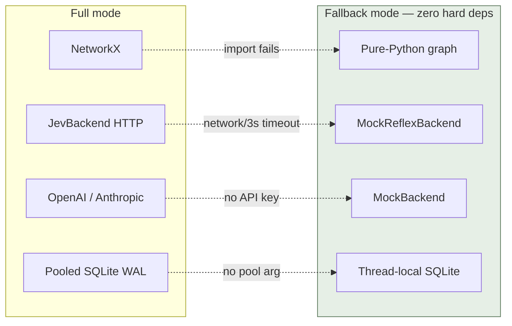

# TechBragging.md — Harness Framework Technical Résumé

> What makes this project genuinely unusual under the hood — the engineering
> decisions worth bragging about, with the receipts — followed by an honest
> assessment of where it needs to get better.

**Version**: 0.4.2 · **Tests**: 1,120 passing in ~15s · **Exports**: 131 · **Surfaces**: 19

---

## Part 1 — What Makes It Unique

### 1.1 A Two-Tier Cognitive Architecture — in a Governance Tool

Most "AI safety" or "AI testing" tools are uniformly slow: every check is an
LLM call. The Harness is built like a mind, not like a test runner:

- **System 1** (`bool`/`score`/`choice` primitives) returns probability
  distributions with **zero text generated** — 115ms, ~$0.00004 per decision.
- **System 2** (scenarios, verifiers, patch generation) only runs when the
  reflex says *escalate* (`confidence < floor` or `score ≥ 7`).
- The escalation isn't an error path — it's the **designed contract**,
  tracked by `EscalationPolicy` with drift statistics.

**Why it's rare**: governance is usually bolted on as a filter. Here, cost
awareness is the architecture itself — the expensive machinery is *behind*
the cheap machinery, and the boundary is measurable.

### 1.2 Rubrics as Governed Artifacts (the Meta-Refinement Trick)

The reflex tier's quality criteria ("rubrics") aren't config — they're
**declared artifacts on the 19th surface**, which means the system's existing
self-improvement machinery applies to them unchanged:

```
rubric change = HarnessPatch(surface="reflex", before, after, inverse=auto)
  → evaluated on held-out decision logs
  → 8 acceptance gates
  → PROPOSED → EVALUATED → ACCEPTED (with lineage)
```

**The receipts**: the analyzer audited its own dogfood scan, proposed a
`required_signals` rubric patch with auto-inverse, proved +0.81 held-out
precision with a ≤5% recall guard, and shipped rubric v2.0.0 —
**cutting real findings 32 → 8 (−75%)** with both baselines committed to the
repo (`docs/reflex_baseline_r0.md`, `r1.md`). Self-improvement with a paper
trail, not a blog post.

### 1.3 Invertible Patch Algebra

Every mutation is a `HarnessPatch` carrying `before`/`after` **and an
auto-computed `inverse`**. That one property unlocks rollback, A/B
evaluation, diff-scoping, and quarantine as free theorems rather than
features. Combined with the promotion pipeline's REVERTED state, "undo" is a
first-class citizen everywhere — configs, rubrics, surfaces, governance
policy itself.

### 1.4 Pure-Python Degradation Ladder

The framework refuses hard dependencies on its own sophistication:

| Component | Full mode | Fallback |
|---|---|---|
| Graph memory | NetworkX MultiDiGraph | Pure-Python `_FallbackMultiDiGraph` (~120 lines) |
| Reflex backend | JevBackend (HTTP) | Deterministic `MockReflexBackend` |
| Agent backend | OpenAI/Anthropic | `MockBackend` |
| TraceStore | pooled SQLite (WAL) | thread-local SQLite / `:memory:` |



**Consequence**: the entire system — graph reasoning, swarm coordination,
reflex gating, meta-refinement — runs offline in CI with **zero network
calls across 1,120 tests**. Determinism isn't a testing strategy here; it's
an architectural invariant.

### 1.5 Chase-Lev Work-Stealing in Pure Threads

The swarm coordinator implements the Chase-Lev deque discipline (owner pops
from the head, thieves steal from the tail) over `queue.Queue`-style
thread-safe deques — the algorithm JVM ForkJoin pools use, carried into a
Python agent runtime with consensus aggregation and **dissent detection**:
workers that disagree with the consensus aren't averaged away, they're
surfaced as `dissenting_views`. Early termination at the agreement threshold
yields 20–40% cost savings.

### 1.6 A Forensic-Grade Integrity Stack

Three independently-verifiable integrity mechanisms, each with its own
threat model:

- **Hash-chained audit log**: `entry_hash = sha256(prev_hash + canonical)` —
  detects modification, deletion, reordering, and truncation with typed
  failure reasons (`hash_mismatch`/`seq_gap`/`link_broken`/`reordered`);
  corrupt-tail quarantine keeps appends valid after partial-write crashes.
- **Content-addressed snapshots**: sha256-sharded, write-once dedupe,
  `verify()` re-hash corruption detection, tombstone index that survives
  reopen.
- **TraceStore pool**: FIFO-fair `queue.Queue` pool, 6 tuned WAL pragmas —
  **5,377 records/sec with 100 concurrent writers, zero lock errors**.

### 1.7 The Dogfood Discipline

The framework's own repository is its reference deployment: the reflex CI
scans its own PRs (advisory mode), the baseline documents live in-repo, and
the very first dogfood scan produced the FP data that justified the phased
autonomy ladder (R0 shadow → R5 meta-refinement, each with measurable
promotion criteria and auto-demotion). The project literally uses its own
promotion pipeline to promote its own autonomy levels.

---

## Part 2 — Honest Weaknesses & Improvement Areas

*Bragging requires contrast. Ranked by impact; feeds directly into
`Harness Framework Optimisation Planning.md`.*

### 2.1 Reducing Complexity

- **131 public exports** is a wide surface; some symbols (`InstrumentedTool`,
  legacy CLI flags) exist for backward compat and could be deprecated behind
  `__getattr__` warnings.
- **Mock heuristics are scattered** across `MockReflexBackend`,
  `QualitativeLinter` constants, and `ci.default_remediate` — a single
  heuristic-signal module would make mock behavior auditable in one place.
- **CLI flag duality** (subcommands + legacy `--harness-*` flags) doubles
  parser maintenance.

### 2.2 Enhancing Security

- **`RunCommandTool` uses `shell=True`** — sandboxed by path allowlists, but
  shell metacharacter injection remains possible; migrate to `shlex.split` +
  `shell=False` with an explicit shell-opt-in.
- **Secret scanning is regex+entropy, not entropy-verified crypto detection**;
  private-key formats deserve structural parsing (PEM headers) over regex.
- **Audit log is tamper-evident, not tamper-proof** — entries aren't signed;
  HMAC or asymmetric signing would catch a forger who rewrites *and*
  re-chains.
- **CI workflows are staged but inactive** (`workflows-pending/`) — the repo
  currently runs without its own gates until activated with a
  workflow-scoped token.

### 2.3 Increasing Efficiency

- **Reflex decisions bypass the connection pool** by default (pool is
  opt-in); making pooled TraceStore the default at >N writes/s would remove a
  tuning foot-gun.
- **Linter rules run sequentially** per snippet; the 6 rules are independent
  and could evaluate concurrently (they're pure functions of the input).
- **`simulate_git_diff` fallback paths re-read files**; a read-through cache
  for scanned file contents would help large repos.

### 2.4 Adopting Best Practices

- **Sphinx docs reference missing pages** (`index.rst` toctree →
  `surfaces.md`, `knowledge_graph.md`, etc. don't exist) — doc build warns.
- **mypy coverage is uneven**: core modules are fully typed, but some `# type:
  ignore` escapes in the fallback graph and CLI deserve resolution.
- **No `pre-commit` config shipped** despite `pre-commit` being a dev dep.
- **One flaky stress test** (`test_concurrent_readers_and_writers`) is
  timing-sensitive under extreme reader pressure.

### 2.5 Optimising Performance

- **DataGateway is synchronous** — the reflex tier's 10x write amplification
  makes the async (aiohttp) gateway the top Wave D item.
- **Trace writes are per-statement autocommit**; a batch-writer mode
  (collect N records, single transaction) would multiply throughput for
  reflex-heavy workloads.
- **Export pipeline absent** — Parquet/OTel export is needed before decision
  logs can flow to warehouses (Wave D, T2.7).

### 2.6 Overall Optimisation (the meta-view)

The system's deepest remaining inefficiency is that **its two tiers aren't
yet closed in production**: meta-refinement is proven on curated corpora,
but the continuous loop (live decision logs → nightly audit → automatic
rubric PRs on this repo) needs the CI workflows active and a production
reflex backend. The architecture is complete; the *always-on* incarnation is
the next milestone — see the optimisation plan, phases 1–2.

---

## Signature Numbers

| Metric | Value | Where proven |
|---|---|---|
| Test suite | 1,120 passing, ~15s, 0 network | `pytest tests/ -q` |
| Reflex decision latency | 115ms fixed-mock / 100–300ms design | `docs/reflex_baseline_r0.md` |
| Pooled trace throughput | 5,377 rec/s, 100 threads, 0 lock errors | `tests/test_trace_store_pool.py` |
| Meta-refinement delta | −75% findings, +0.81 held-out precision | `docs/reflex_baseline_r1.md` |
| Context reduction (KG) | ~99% (200 pages → ~50 triples) | `SYNTHESIS.md` |
| Swarm speedup | 3.2–4.8x vs sequential | `tests/test_swarm.py` |
| Runtime dependencies | 2 (pyyaml, networkx-optional) | `pyproject.toml` |
